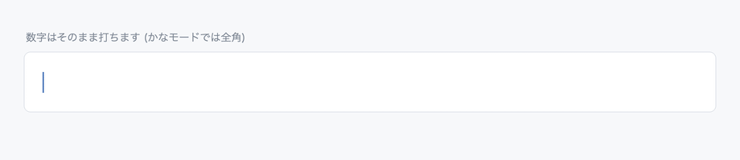
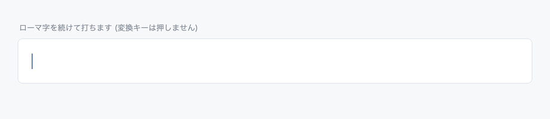
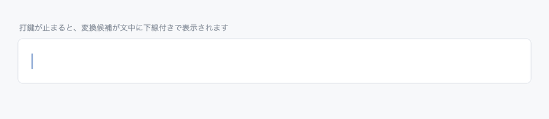
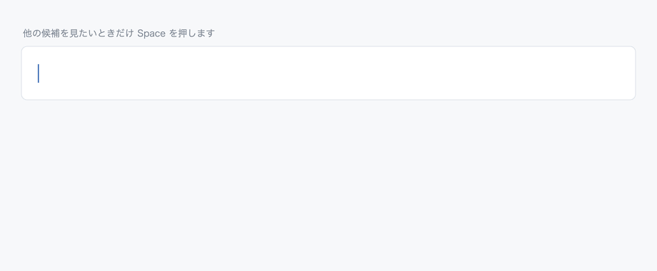
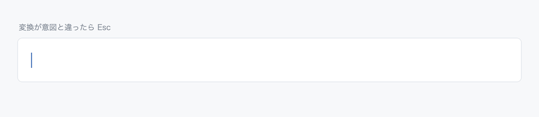
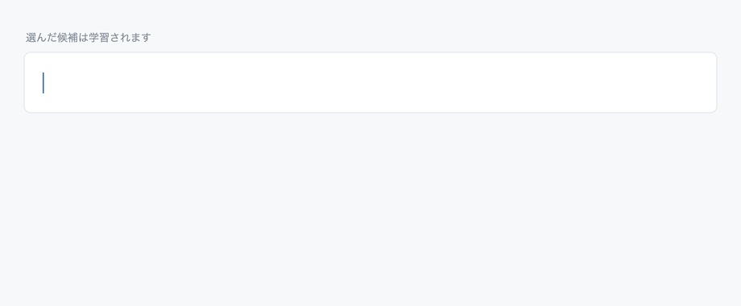
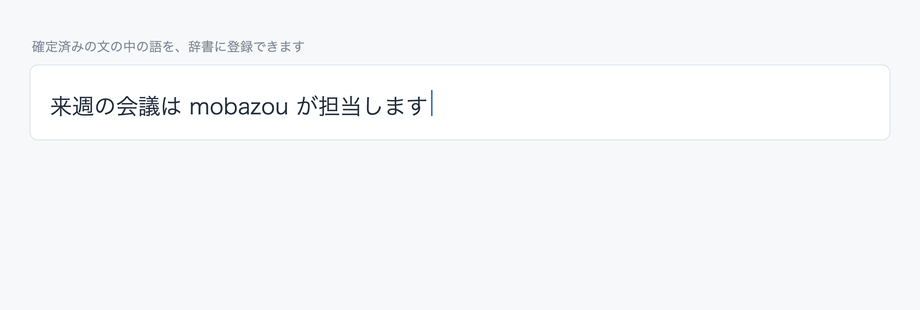

# Roman 基本操作の概要

Roman の基本操作を、動画(GIF)で一通り紹介します。それぞれの詳しい仕組みと操作は[ユーザマニュアル](manual.md)を参照してください。

対応バージョン: **Roman 1.18**

図中のかな・変換結果・候補は、すべて実物(Roman のローマ字かな変換と、変換サーバの実際の応答)です。

## 英字・数字・空白の入力

数字はそのまま打てば全角で入り、助数詞と一緒に変換されます。英字は **Shift** を押しながら打つと、変換を通さず半角の大文字でそのまま入ります(**下線は付きません**)。空白は、変換候補が無いときの **Space** が全角、**Shift+Space** が半角です(変換候補があるときの Space は候補ウィンドウです — マニュアル §3.2)。

## 打鍵とタメによる変換

変換キーは押しません。ローマ字を続けて打ち、手が止まると — この間合いを**タメ**と呼びます — そこまでが自動で変換されます。続きを打ち始めると前の分は確定し(下線が消えます)、文末でまた手が止まると残りも変換されます。このとき、**確定済みの前の文も文脈として踏まえて**候補が選ばれます(マニュアル §3.2)。

## インラインへの候補自動表示と確定

変換候補は別ウィンドウではなく、カーソル位置の文中に下線付きで表示されます(**インライン表示**)。**Enter** で確定するほか、しばらく打鍵が無ければ次の文字を打った時点で自動確定します(マニュアル §3.3)。

## Space による候補ウィンドウの表示と選択

別の表記にしたいときだけ **Space** を押します。候補ウィンドウが開き、**Space / ↓** で候補を移動(インラインにプレビュー)、**Enter** や数字キーで確定します。

学習していないかな・カタカナのまま入れたいときは、先頭で **↑** を押すと**畳みゾーン**が開き、そこから選べます(マニュアル §3.4)。

## Esc

変換が意図と違ったら **Esc** で全てひらがなに戻せます(打鍵は失われません)。もう一度 **Esc** を押すと丸ごと取り消します(マニュアル §3.6)。

## 文字の学習

候補ウィンドウで選んで確定すると、その文を品詞分解して**含まれる名詞がまとめて学習されます**(下の例では1文から「会議」「製品」「企画」の3語)。学習は時間とともに古びていき、使うたびに若返るので、**直近に選んだ表記ほど優先されます**。学習した語の確認・取り消しは Roman 設定からできます(マニュアル §3.5)。

## 単語登録

確定済みの文の中の語は、辞書に登録できます。カーソルを文中に置いて **Shift+→** で語を選択し、**↓** を押すと登録パネルが開きます。**読みを打って Enter** で登録され、次からはその読みで出ます(マニュアル §3.6 辞書登録)。

